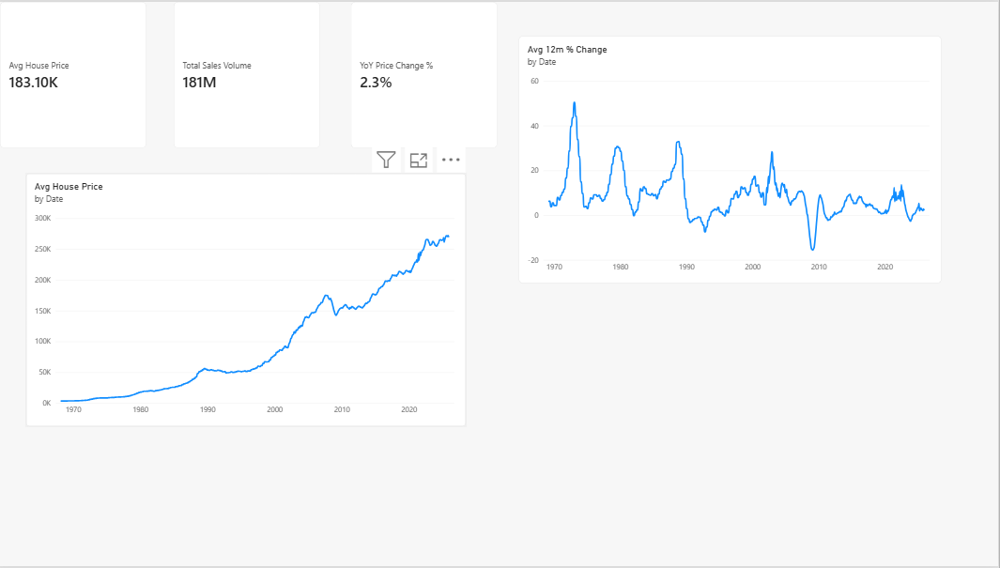
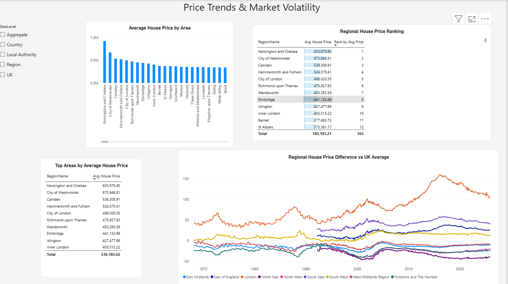
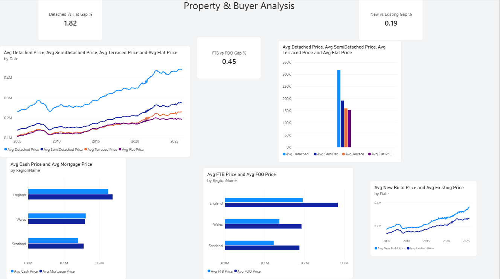
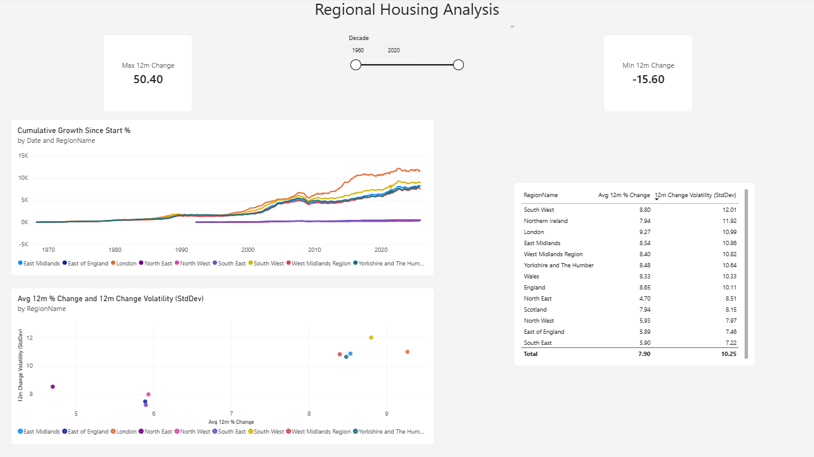

# UK House Price Index — End-to-End Data Analysis Project

An end-to-end analysis of HM Land Registry's UK House Price Index (1968–2025): cleaned and explored in Python, queried in SQL, and visualized in an interactive Power BI dashboard.


---

## Business Understanding

The UK housing market has changed substantially over the past several decades, but those changes vary considerably by region, property type, and buyer segment. This project analyses HM Land Registry's UK House Price Index to surface long-term trends, regional differences, property-type patterns, and buyer behaviour — see [`docs/business_understanding.md`](docs/business_understanding.md) for the full business problem, objectives, key questions, and stakeholders.

The project follows the standard analytics lifecycle:

**Business Understanding → Data Understanding → Data Cleaning → Exploratory Data Analysis → SQL Analysis → Dashboard Development → Insights & Recommendations**

**Data source:** [HM Land Registry, UK House Price Index](https://www.gov.uk/government/collections/uk-house-price-index-reports) — the official record of UK residential property transactions, published monthly.

---

## Repository Structure

```
uk-house-price-project/
├── docs/
│   ├── Business_Understanding.docx         # Original business understanding document
│   └── business_understanding.md           # Same content, rendered for GitHub
├── data/
│   ├── UK-HPI-full-file-2025-12.csv        # Raw source data
│   └── UK_HPI_cleaned.csv                  # Cleaned, analysis-ready dataset
├── notebook/
│   └── UK_House_Price_Project_Step_3.ipynb # Data cleaning, EDA, and SQL analysis (via DuckDB)
├── powerbi/
│   └── Uk_house.pbix                       # Interactive dashboard
├── presentation/
│   └── UK_House_Price_Project.pptx         # Project summary slide deck
├── screenshots/
│   ├── overview.png
│   ├── regional_comparison.png
│   ├── property_buyer_analysis.png
│   └── trends_volatility.png
└── README.md
```

---

## Step 1 — Data Cleaning

Performed in pandas, on the raw 34MB HM Land Registry export:

- Converted `Date` to proper datetime; validated — zero invalid entries
- Checked for duplicate Region + Date combinations — none found
- Validated `AveragePrice`, `SalesVolume`, `Index` — no negative values
- Column-by-column missing value analysis:
  - Dropped `AveragePriceSA` / `IndexSA` — populated only for a handful of national aggregate rows, not usable at Local Authority grain
  - Flagged buyer-type columns (`FTB*`, `Cash*`, `Mortgage*`, `FOO*`) as recent-data-only (published from 2011/2012 onward)
- Built a `GeoLevel` classification (`UK` / `Country` / `Region` / `Local Authority`), catching and fixing a mislabeling bug where two national aggregates (`England and Wales`, `Great Britain`) were incorrectly tagged as `Local Authority`
- Added calculated columns: `Year`, `Month`, `Quarter`, `Decade`, `PriceGrowthSinceStart` (cumulative growth per region since its first record), `RegionalPriceDiff` / `RegionalPriceDiffPercent` (each region vs. the UK average, month by month)

**Result:** 149,085 rows × 62 columns, fully validated.

---

## Step 2 — Exploratory Data Analysis

Key findings, pulled directly from the data:

| Metric | Finding |
|---|---|
| **UK price growth since 1968** | 8,062% — from £3,311 (Apr 1968) to £270,259 (Dec 2025) |
| **Detached vs. Flat price ratio** | 2.3× — £440,564 vs. £192,826 (latest month) |
| **First-Time Buyer vs. Former Owner-Occupier gap** | 44.7% — £244,799 vs. £354,250 (England) |
| **Annual growth volatility** | Negative in 89 of the last 681 months; sharpest drop -15.6% (Feb 2009), fastest gain +50.4% (Jan 1973) |

---

## Step 3 — SQL Analysis

Included in `notebook/UK_House_Price_Project_Step_3.ipynb`, run live via **DuckDB** directly against the cleaned dataset — no separate database required to reproduce.

Techniques demonstrated:

- `GROUP BY` — top areas & average price by geography
- `CASE` — price-band classification
- **CTEs** — multi-step yearly aggregation
- **Window functions** with `PARTITION BY` — per-region calculations
- `LAG()` — year-over-year price change
- `RANK()` — top 3 priciest regions per year
- `FIRST_VALUE()` — cumulative growth since each region's first record

One nice cross-check: the SQL `FIRST_VALUE()`-based growth calculation and the pandas-derived `PriceGrowthSinceStart` column agree exactly — **8,062.5%** both ways.

---

## Step 4 — Power BI Dashboard

A 4-page interactive dashboard, built on a star schema (Fact + Region + Date tables) with DAX measures behind it, including `LAG`/`SAMEPERIODLASTYEAR`-based year-over-year calculations, `RANKX`-based live rankings, and rolling averages.

### Overview
KPI cards, the UK price trend (1968–2025), and 12-month price growth with positive/negative shading.



### Regional Comparison
Average price by area, a live-ranked table, and each region's price gap vs. the UK average over time — with a `GeoLevel` slicer to drill from Local Authority up to Country.



### Property & Buyer Analysis
Detached/Semi-Detached/Terraced/Flat price trends, Cash vs. Mortgage buyers by country, First-Time Buyers vs. Former Owner-Occupiers, and New Build vs. Existing property prices.



### Trends & Volatility
Cumulative growth by region since 1968, a growth-vs-volatility scatter, and a regional volatility ranking (standard deviation of 12-month change).



---

## Step 5 — Project Summary Deck

`presentation/UK_House_Price_Project.pptx` — a 10-slide walkthrough of the whole project, suitable for a portfolio review or interview presentation.

---

## Tech Stack

- **Python** — pandas, matplotlib
- **SQL** — DuckDB
- **Power BI** — Power Query, DAX, star-schema data modeling
- **Jupyter Notebook**

---

## How to Reproduce

1. Clone this repo.
2. Open `notebook/UK_House_Price_Project_Step_3.ipynb` and run all cells — this reproduces the data cleaning, EDA, and SQL (DuckDB) analysis end-to-end, using `data/UK-HPI-full-file-2025-12.csv` as input and producing `data/UK_HPI_cleaned.csv`.
3. To explore the dashboard: open `powerbi/Uk_house.pbix` in Power BI Desktop. If prompted to refresh data sources, point them at `data/UK_HPI_cleaned.csv`.

---

## Data Source & License

Data from HM Land Registry's UK House Price Index, contains HM Land Registry data © Crown copyright and database right 2025. This data is licensed under the [Open Government Licence v3.0](https://www.nationalarchives.gov.uk/doc/open-government-licence/version/3/).
